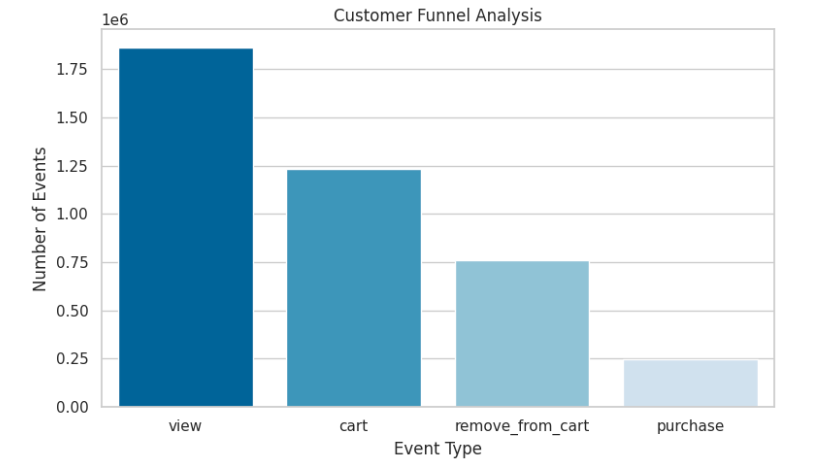
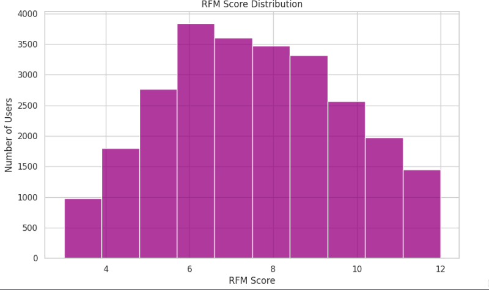

# 💄 Customer Behavior Analysis – Cosmetics E-commerce Store

This project explores and analyzes customer behavior in an online cosmetics store using one month of simulated e-commerce event data. The goal is to derive actionable insights through funnel analysis, RFM segmentation, and visual storytelling — similar to real-world customer analytics projects handled in market research or freelance settings.

---

## 🎯 Project Objective

- Analyze customer actions like **view**, **cart**, and **purchase**
- Perform **funnel analysis** to evaluate conversion behavior
- Use **RFM (Recency, Frequency, Monetary)** segmentation to identify key customer groups
- Prepare insights suitable for business or client decision-making

---

## 🧰 Tools & Technologies

- **Python** (Pandas, Matplotlib, Seaborn)
- **Jupyter Notebook** / Kaggle Notebook
- **Power BI** (planned for extended dashboard)
- **GitHub** for version control & portfolio presentation

---

### 📄 Folder Descriptions

- `README.md`: Project overview and documentation  
- `freelance-customer-insights-project-cosmetics.ipynb`: Final Jupyter notebook with step-by-step code  
- `output_visuals/`: Saved plots from analysis (e.g., funnel, RFM)  
- `data/`: Info about dataset source (not the full dataset)  
- `PowerBI/`: Dashboard file or export (optional, if used)  
- `LICENSE`: Open source usage license (MIT or custom)  
- `.gitignore`: Ignore unnecessary system or notebook cache files  

---

## 📊 Sample Visualizations

### 🔸 Funnel Chart

### 🔸 RFM Segmentation

---

## 📦 Dataset Source

- 📌 [Kaggle Dataset: Ecommerce Events History in Cosmetics Shop](https://www.kaggle.com/datasets/mkechinov/ecommerce-events-history-in-cosmetics-shop)
- This dataset simulates user behavior over multiple months in an online cosmetics store.

---

## 💼 Freelance/Client Use Case

> “While transitioning from market research, I started doing client-style projects in customer analytics to apply my skills hands-on.”

This project is a strong freelance-style showcase of data transformation, EDA, funnel analysis, and customer segmentation — which reflects real-world tasks performed by:
- Customer Insights Analysts
- Consumer Behavioral Analysts
- CRM/Data Analysts in Marketing
- Market Research Agencies

---

## ✅ Key Takeaways

- Conversion rate insights for business improvement  
- Segmentation of customers for targeted marketing  
- Visual dashboards for business storytelling

---

## 📬 Contact

If you're a recruiter, hiring manager, or collaborator interested in data analytics, feel free to connect!

---

> ⚠️ This project is for **portfolio and learning purposes**. Dataset is public and simulated, but methodology mirrors real client work.

